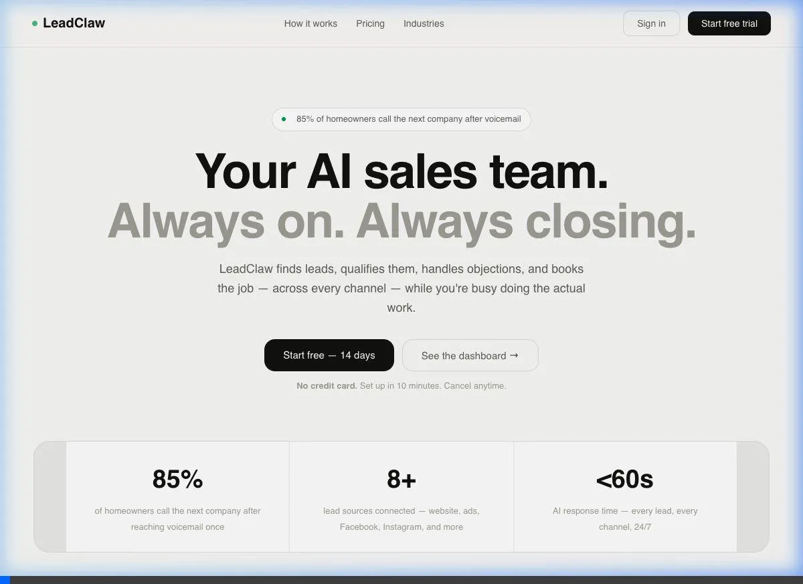
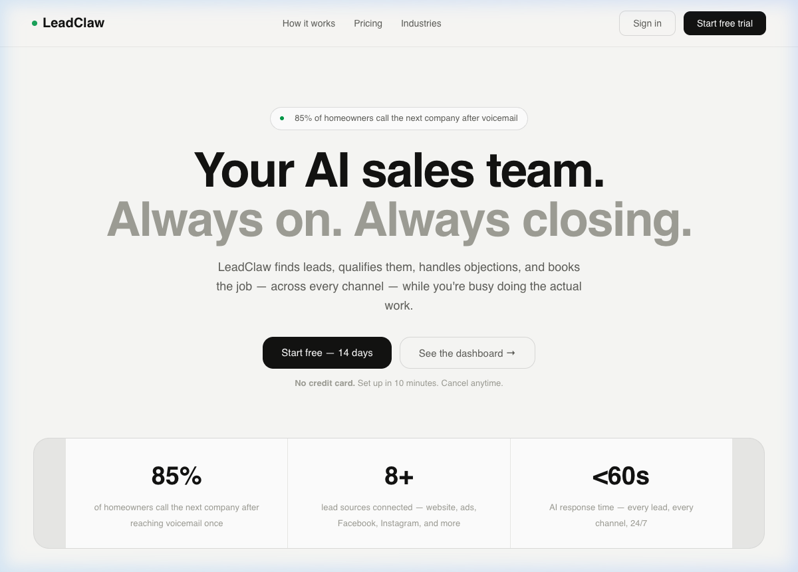
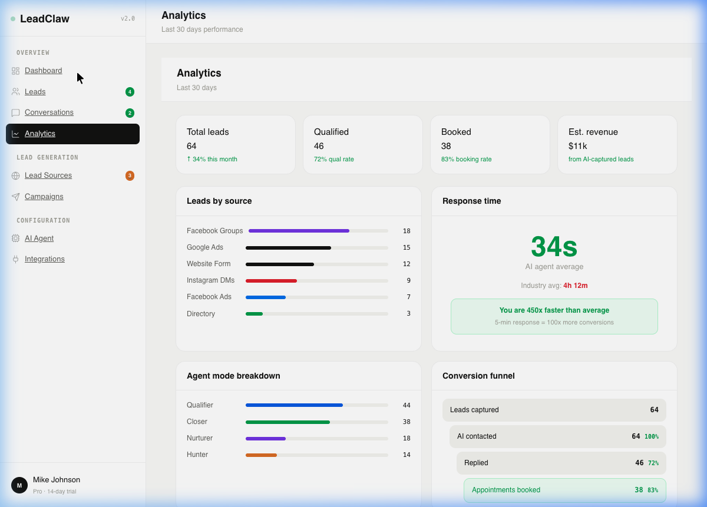
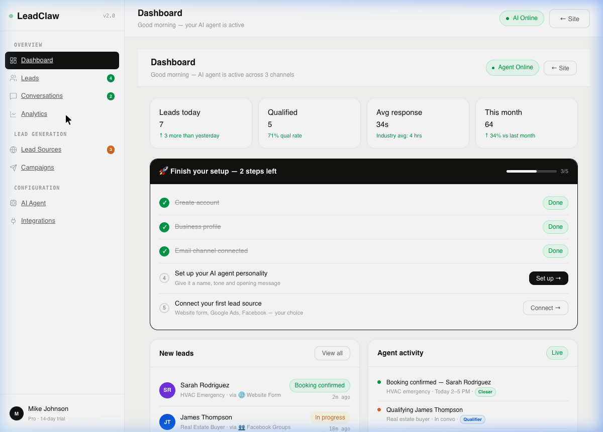
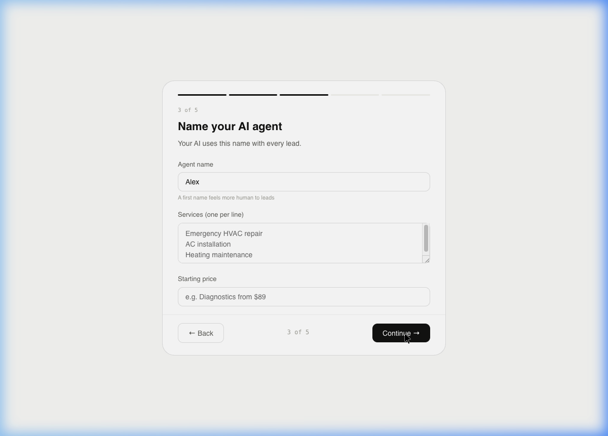

# LeadClaw — AI Sales Agent for Service Businesses

LeadClaw is an AI-powered sales platform designed to help service businesses (HVAC, Plumbing, Real Estate, etc.) capture, qualify, and book leads 24/7 across multiple channels.

## LeadClaw V2 — Design Parity Reached 🚀

This repository contains the LeadClaw V2 React application, fully synchronized with the latest design specifications. 

### Key Features
- **Multi-Channel Capture**: Website, Facebook Groups, Instagram DMs, Google Ads.
- **AI Sales Intelligence**: 4 specialized agent modes (Hunter, Qualifier, Closer, Nurturer).
- **Automated Booking**: Integration with Cal.com for seamless appointment setting.
- **Analytics Dashboard**: Real-time tracking of lead sources, response times, and conversion funnels.

## Visual Verification

### Verification Recording


### UI Highlights

| Landing Page | Dashboard |
| :---: | :---: |
|  |  |

| Analytics | Onboarding |
| :---: | :---: |
|  |  |

## Development

```bash
# Install dependencies
npm install

# Run development server
npm run dev

# Build for production
npm run build
```

## Deployment
Deployed via Railway.
